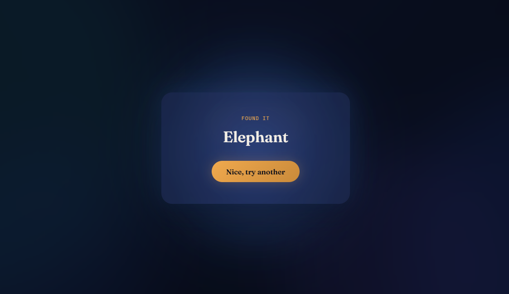
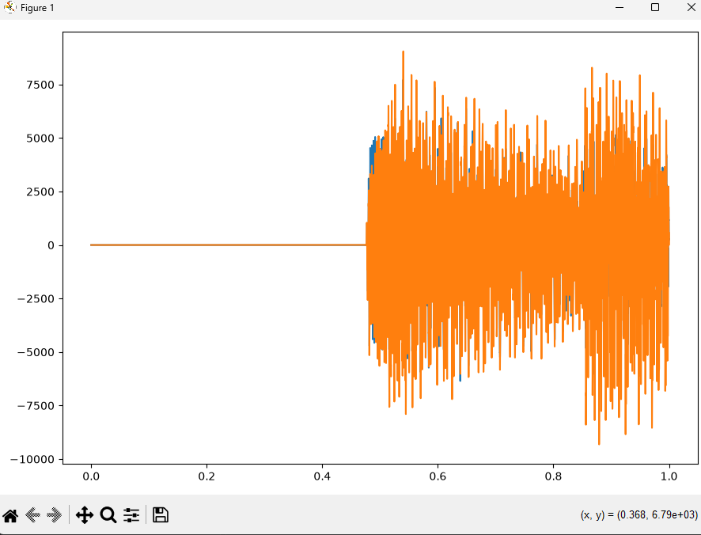
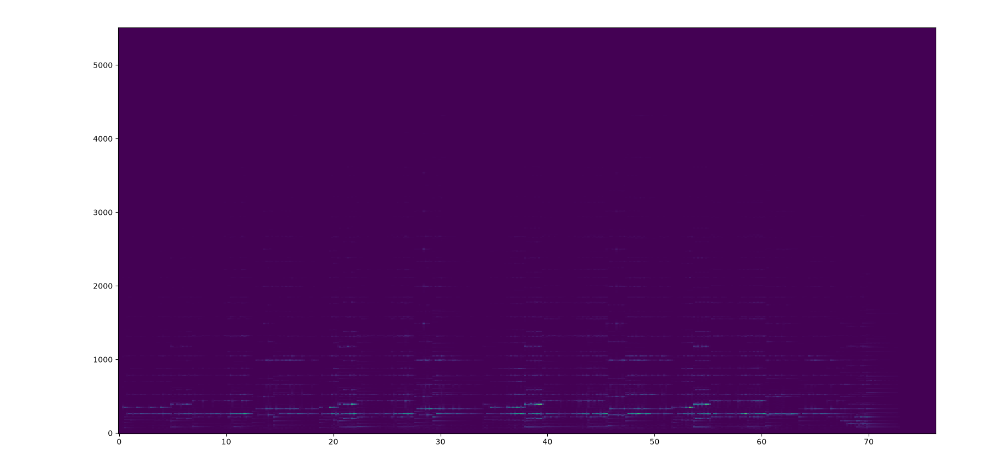
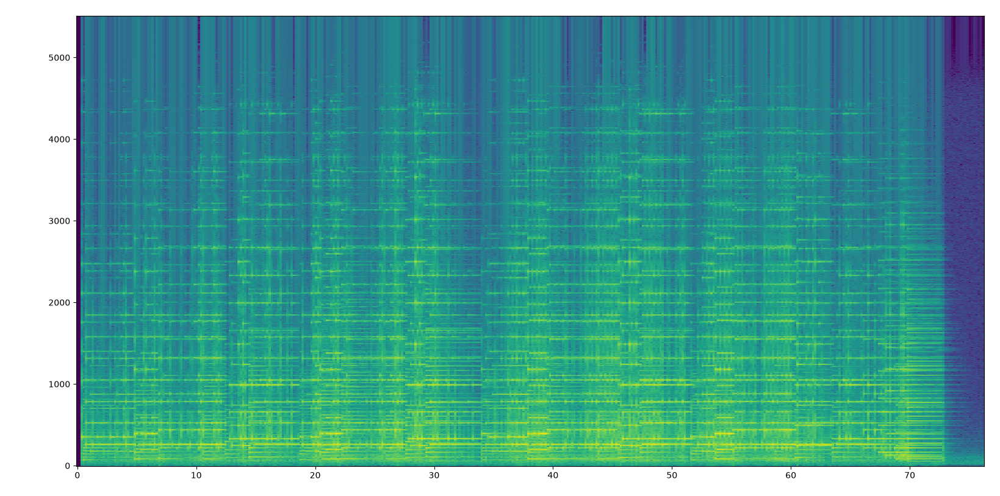
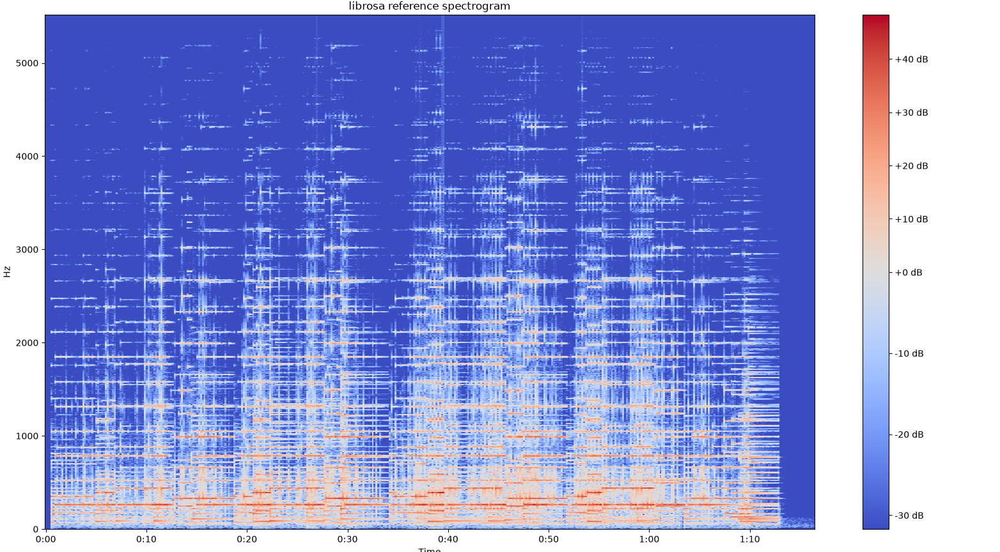
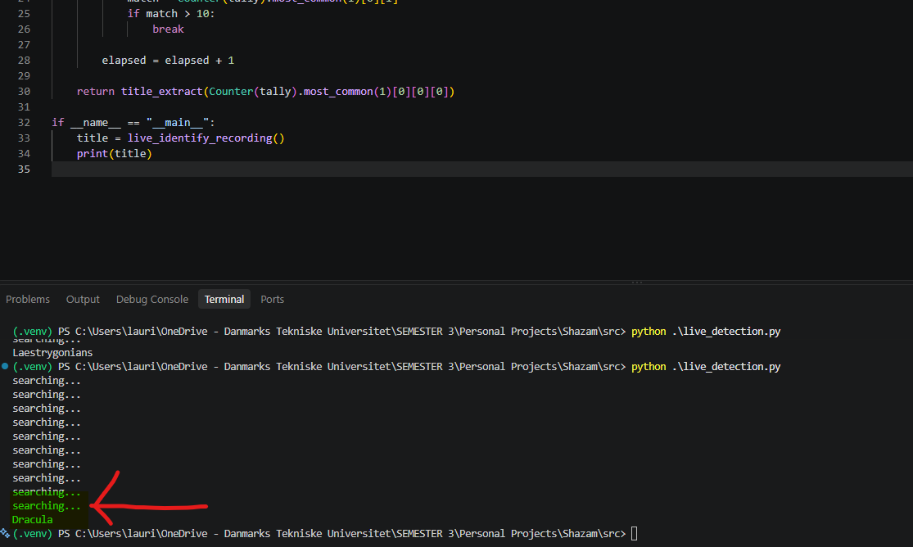

# FFTea

A Shazam clone built from 'scratch' in Python. Give it a few seconds of audio through a microphone and it tells you what song is playing, using a fingerprinting algorithm I wrote myself. Video demos can be found on my portfolio site: https://lauritz-portfolio.netlify.app/

I am a few weeks away from starting a digital signal processing course at DTU, and I wanted a project that would force me to actually understand the theory before the course throws it at me, rather than learning it purely on paper. I am strongest in C and still getting comfortable with Python, so this project ended up being two things at once, a crash course in Python by doing, and an excuse to actually build the thing I have used my whole life without ever wondering how it works, a phone that can hear a few seconds of a song playing in a noisy room and just know what it is.

## What it actually does

Right now it can listen through your own computer's microphone, record a few seconds at a time, and check what it heard against a small local database of songs I fingerprinted myself. If it finds a confident match it tells you the title. The database currently holds a modest handful of songs, since building it out further is mostly just a matter of feeding more files in, not a technical challenge.

## Why build the algorithm myself

I could have called a library and had song recognition working in an afternoon. That was never the point. The actual goal was understanding what a spectrogram really is, why Shazam specifically looks at peaks instead of raw frequency data. Then it's all about how you turn "two points in a spectrogram" into something you can hash and look up instantly in a database. The only way I know how to actually learn something like that is to build it with my own hands and get it wrong a few times first. Or many.

Same reasoning went into picking a real SQLite database over just pickling a dictionary to disk, which would have been faster to write. I have never actually worked with a database hands on before, and this felt like a good, contained excuse to finally do that properly instead of taking the shortcut. I am no expert, but now I sure have an idea on how it's put together.

## Building stages

### Stage 0. Learning to walk before running

Before touching a single real audio file, I built a synthetic signal by hand, just a couple of sine waves added together, and ran an FFT on it to confirm it correctly found the exact frequencies I put in. This became genuinely important later, since `np.fft.fft` stayed my correctness oracle for the rest of the project.

### Stage 1. Actually looking at a sound file

I loaded a real WAV file using `scipy.io.wavfile` specifically, not the more common `librosa`, despite the recommendations in forums. This is because I found that `librosa` quietly resamples and mixes stereo down to mono for you. I however wanted to see the raw, untouched data first. Sample rate, bit depth, stereo channels, all of it exactly as the file actually stores it.

Converting stereo down to mono by averaging the two channels sounds trivial, and it mostly is, except I managed to write `int32 + int16 / 2` in a way where operator precedence meant only one channel actually got divided. A silly mistake but ah well, that's how we learn.

### Stage 2. Building a spectrogram from scratch

This stage was chopping the audio into small overlapping frames and applying a Hamming window to each one to avoid spectral leakage. This was a cool way to learn about window functions as I recall reading about them and struggling to build intuition. Afterwards I was running an FFT per frame and stacking the results into a proper time versus frequency picture. And this is what's called the Short Time Fourier Transform supposedly!

The first honest attempt looked basically like a black rectangle, since a handful of loud outlier values were washing out everything else on a linear color scale. Converting to decibels and capping the color range fixed it.

I also built a second reference version using `librosa` with matching settings, purely to check my own version against something trustworthy.

They matched closely, though mine came out slightly noisier, which turned out to be because `scipy.signal.decimate`'s default anti aliasing filter is noticeably simpler than whatever high quality resampler `librosa` uses under the hood.

### Stage 3. Turning a spectrogram into something distinctive

A raw spectrogram is enormous and completely unusable for actually identifying a song. This stage was implementing Shazam's actual published trick, splitting the frequency range into six logarithmically spaced bands so bass content cannot dominate everything, finding the single loudest point in each band per time frame, then keeping only the ones that beat the average of all six for that moment. What is left is a sparse constellation of just the standout points, a few hundred instead of hundreds of thousands.

### Stage 4. Turning peaks into a searchable fingerprint

For every peak, treated as an anchor, I looked forward a few seconds for nearby peaks as targets, then packed the anchor's frequency, the target's frequency, and the time gap between them into a single 32 bit number using bit shifting. First real hands on bit manipulation I have done in Python, and it mapped surprisingly cleanly onto things I already knew from C.

### Stage 5. An actual microphone, and an actual matching algorithm

This is the part where the project stopped being a series of isolated technical exercises and became one working thing. Real microphone input through `sounddevice`, listening in small chunks instead of one fixed recording, and for every chunk, checking its hashes against the whole database and tallying which song and which time offset kept showing up together. A real match shows up as many hashes agreeing on the exact same offset, coincidental noise just scatters randomly, so whichever combination has the most agreement wins. It keeps listening, chunk after chunk, until it is actually confident, rather than committing to a fixed length guess.

Along the way I also found out the hard way that `sqlite3` connections are tied to whichever thread created them, which broke the moment Flask started handling requests on a different thread than the one that opened the database. And a much sillier discovery, `fingerprints.hash` had no index on it at all, meaning every single lookup was scanning the entire table from scratch, hundreds of thousands of rows, over and over, per chunk. Barely noticeable on my own machine, genuinely painful the moment I tried running this somewhere with real CPU limits. More on that in the subsequent section.

### Stage 6. A front end, and a deployment story with an honest ending

Being upfront here, the actual visual design, the animated background, the button, the result modal, was built with heavy help from Claude. The point of this project was always the algorithm, not CSS, and I did not want to burn days I did not have on frontend polish I was never going to learn much from anyway.

I then went down the road of actually deploying this properly, live on the internet, with the microphone recording happening in a visitor's own browser instead of my machine, uploaded in chunks, decoded through ffmpeg, running inside Docker on a free hosting tier. I got it fully working, genuinely, browser microphone permission, chunked uploads, the whole thing, live on a real URL.

And then I killed it. It kept fighting me in small, annoying ways once actually deployed, and at some point I realized I was spending far more effort making a demo publicly hostable than I ever spent on the algorithm itself, for something whose only real audience is a couple of people glancing at a portfolio. So I stripped all of that back out and went back to the simple local version, one button, one call, my own microphone, and I will just record a video of it working instead. Knowing when a good idea has stopped being worth it is apparently also part of finishing a project.

## What I learned

This project touched a lot more than I expected going in.

How a spectrogram is actually built, not just what it looks like.

Why Shazam looks at peaks specifically instead of raw frequency data, and that it is a deliberate noise resistance choice, not an arbitrary simplification.

A real, hands on feel for bit packing, something I had only ever seen described, never actually done.

My first real experience with databases, indexes, and exactly how much a missing index can cost you.

Working with python is fun.

Knowing when to stop...

## What is next

The honest, current limitation, tested with clean digital slices rather than noisy microphone input, isolated short clips do not reliably line up with how the reference database's frames are laid out, since neither uses overlapping windows yet. The algorithm and database both check out fine on their own, a full song matches itself perfectly, this is specifically about analyzing a short clip in isolation. Overlapping frames is the fix, just not one I wanted to rush in at the very end of this first pass.

The bigger thing I actually want to come back to, once my DSP course has properly covered the theory, is replacing the two big library calls I leaned on this whole project, `np.fft.fft` and `scipy.signal.decimate`, with a hand rolled FFT implementation and a hand designed low pass filter of my own. The library versions stay in the whole time as the correctness check, exactly like they did for everything else here, I just want to actually build the things I currently trust blindly.

Smaller, more mundane things for later, artist names alongside song titles, a bigger song database, and maybe a second, more careful attempt at deploying this somewhere public once the algorithm itself is more robust. But that's a bigger if. The purpose is building something that works, and learning from it.

For now though, this first pass genuinely works, end to end, my own microphone, my own database, my own algorithm the whole way through. Solid place to call this version done.
